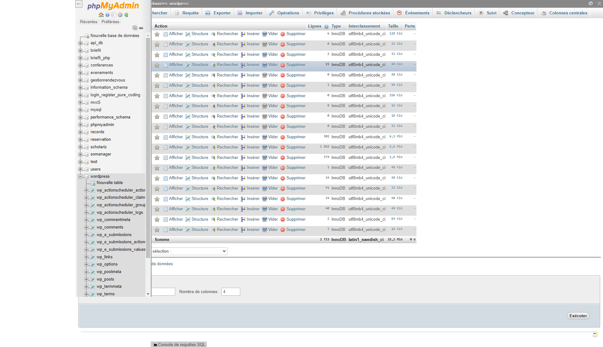
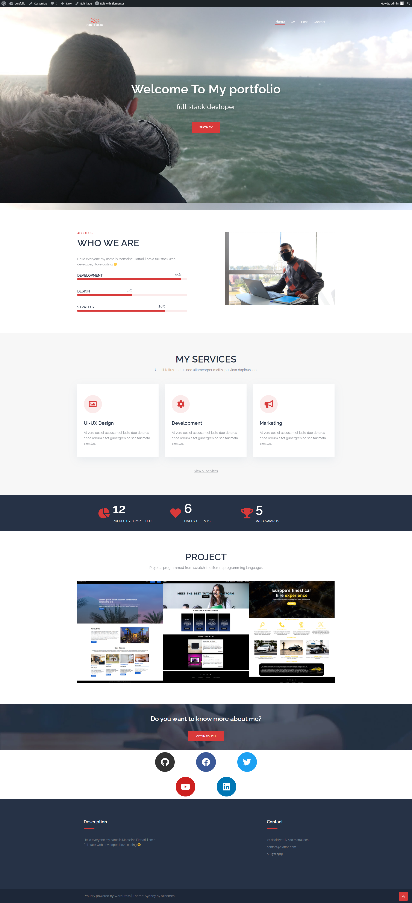
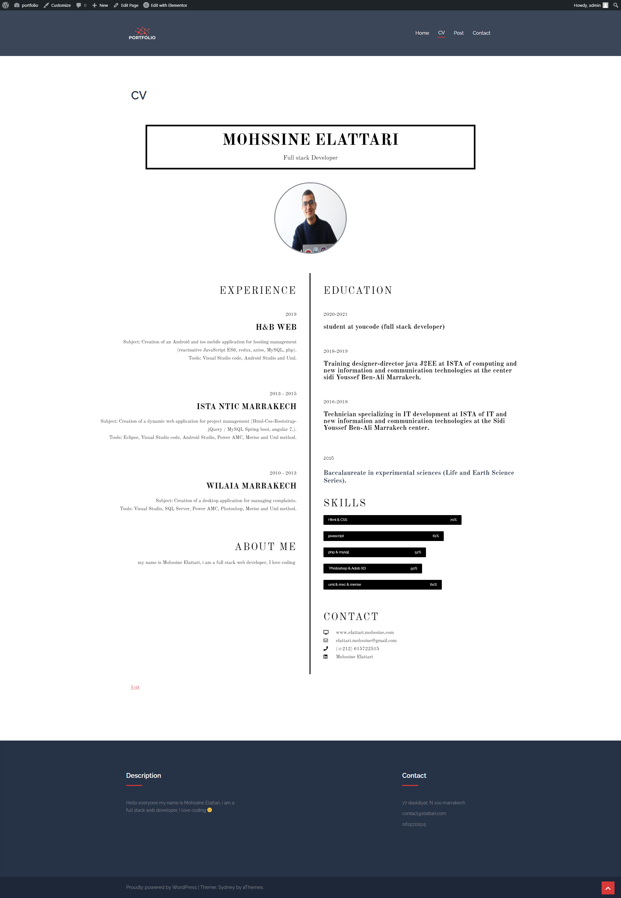

# Wordpress-portfolio

# Contexte du projet
Consolider la recherche déjà effectué à propos du CMS dans un document.

Apporter des modifications au contenu d'un site fournie en utilisant un thème qui a la même structure et en utilisant des plugins de création de contenu.

les instruction à suivre :

Installation de Wordpress après le téléchargement de son code source.

Création de la base de données qui sera utilisé par WordPress pour création de ses tables.

Créer des utilisateurs avec différent rôles.

Télécharger un thème de votre choix et importer un site démo puis adapter son contenu à votre contexte (2 pages min)

​

ex:

Télécharger et installer le thème "Neve"

Importer le site démo "Freelancer" depuis le volet "Neve Option"

Adapter le contenu à votre profil

Ajouter une page "CV" contenant votre cv

​

Vous pouvez ajouter les extensions que vous jugez nécessaires pour faciliter votre travail

# ----------------------------------------------------------------

<strong> Installation: </strong>

1 - Installation du wordpress sur: https://wordpress.org/download/

2 - Création d'une base de donnée MYSQL nommé: wordpress

3 - Installation de wordpress: localhost/wordpress

4 - Configuration: urname: root, Password: , status : Administateur

5 - Type du Projet: Portfolio avec un CV, une page poste.

6 - Téléchargement du plugin ELEMENTOR PRO 

7 - Importer un Theme qui s'appel SYDNEY :https://wordpress.org/themes/sydney/

8 - Edition du Demo avec ELEMENTOR PRO.

9 - Creation des utilisateurs.

10 - Sauvegarder.
